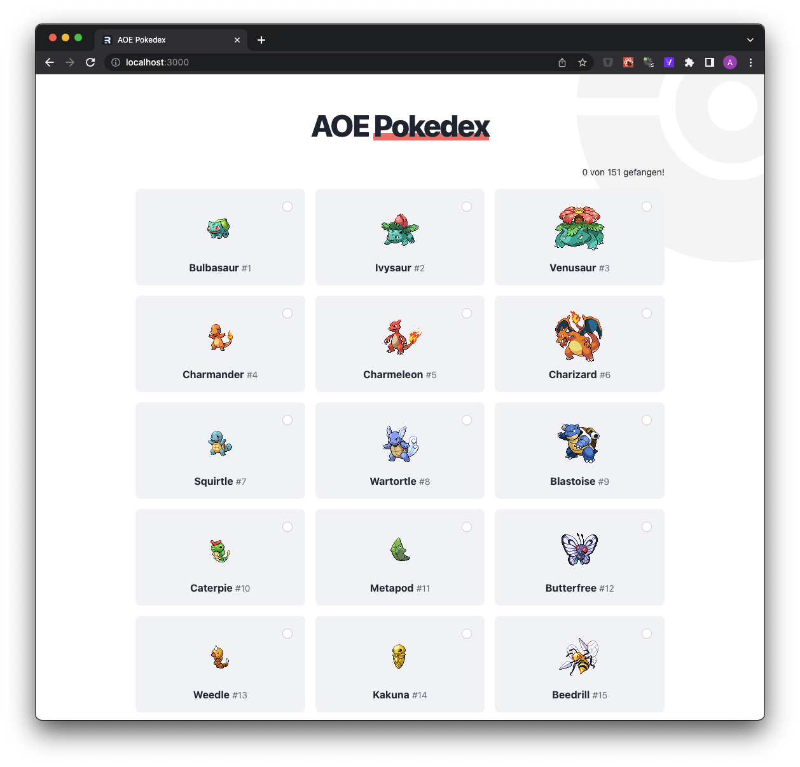

# AOE Pokedex



## Backend
* Flamingo
* Graphql

Run the backend:
```
$ cd backend
$ go run . serve
```

http://localhost:3322/graphql-console

## Frontend
* Remix
* React
* Typescript
* Tailwind CSS
* GraphQL Request

Run the frontend:
```
$ cd frontend
$ npm install
$ npm run dev
```
(if `npm run dev` errors after the first time you run it, just re-run the command)

http://localhost:3000/
